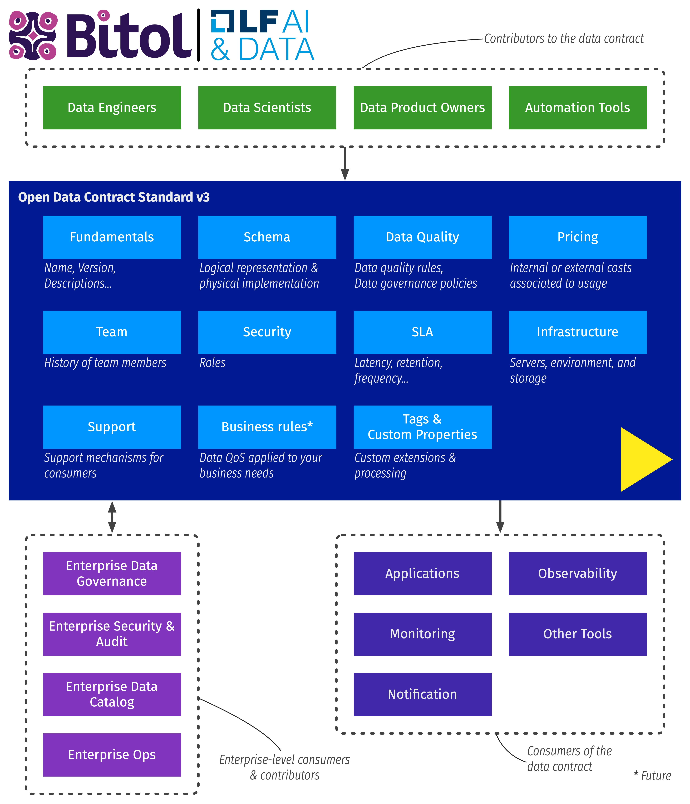

[](https://www.bestpractices.dev/projects/8149)

# Open Data Contract Standard (ODCS)

Welcome! 

Thanks for your interest and for taking the time to come here! ❤️

## Executive summary
This standard describes a structure for a **data contract**. Its current version is v3.0.2. It is available for you as an Apache 2.0 license. Contributions are welcome!

## Discover the open standard
A reader-friendly version of the standard can be found on its [dedicated site](https://bitol-io.github.io/open-data-contract-standard/).

Discover the [Open Data Contract Standard](docs/README.md). This file contains some explanations and several examples. More [examples](docs/examples/README.md) can be found here.

## What is a Data Contract?

### The basics of a data contract
A data contract defines the agreement between a data producer and consumers. A data contract contains several sections:

* [Fundamentals](docs/README.md#fundamentals).
* [Schema](docs/README.md#schema).
* [Data quality](docs/README.md#data-quality).
* [Support & communication channels](docs/README.md#support-and-communication-channels)
* [Pricing](docs/README.md#pricing)
* [Team](docs/README.md#team)
* [Roles](docs/README.md#roles)
* [Service-level agreement (SLA)](docs/README.md#service-level-agreement-sla).
* [Infrastructures & servers](docs/README.md#infrastructure-and-servers)
* [Custom properties](docs/README.md#custom-properties).



*Figure 1: illustration of a data contract, its principal contributors, sections, and usage.*

### JSON Schema

JSON Schema for ODCS can be found [here](https://github.com/bitol-io/open-data-contract-standard/blob/main/schema/odcs-json-schema-latest.json). You can import this schema into your IDE for 
validation of your YAML files. Links below show how you can import the schema:

- [IntelliJ](https://www.jetbrains.com/help/idea/json.html#ws_json_schema_add_custom)
- [VS Code](https://code.visualstudio.com/docs/languages/json#_json-schemas-and-settings)

## Articles and Other Resources
Check out the [resources](resources.md) page.

## Contributing to the project
Check out the [CONTRIBUTING](./CONTRIBUTING.md) page.

## More

### Citation

If you need to cite this standard, you can use the following BibTeX entry:

```bibtex
@manual{ODCS2025,
  title        = {Open Data Contract Standard (ODCS)},
  author       = {{Bitol}},
  organization = {LF AI \& Data Foundation},
  year         = {2025},
  url          = {https://bitol-io.github.io/open-data-contract-standard}
}
```

### Mime/Media Type

The official media (fka mime) type is:

```
application/odcs+yaml;version=3.0.2
```


