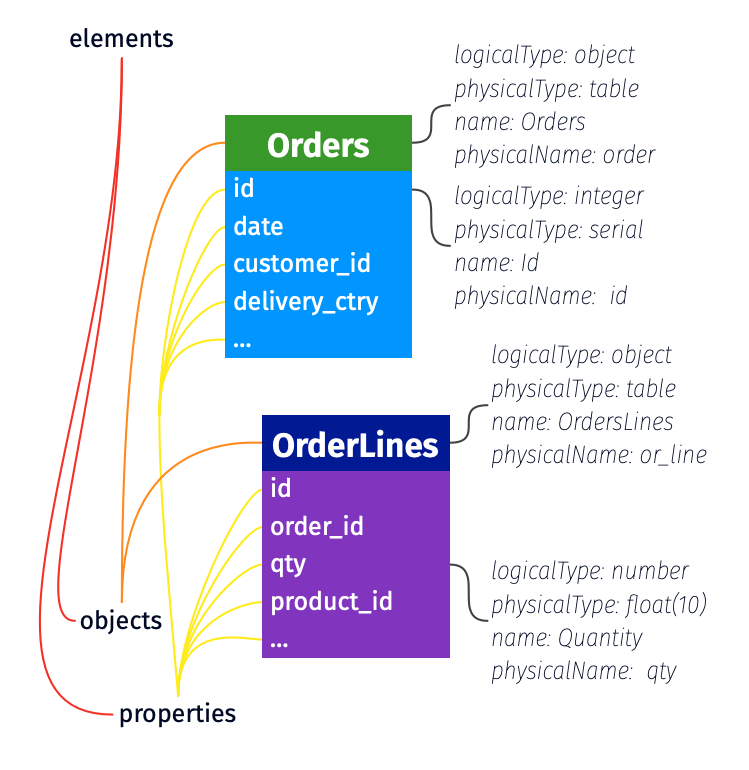

<!--
Copyright 2026 The Bitol Contributors
SPDX-License-Identifier: Apache-2.0
-->

# Schema

This section describes the schema of the data contract. It is the support for data quality, which is detailed in the next section. Schema supports both a business representation of your data and a physical implementation. It allows to tie them together.

In ODCS v3, the schema has evolved from the table and column representation, therefore the schema introduces a new terminology:

* **Objects** are a structure of data: a table in a RDBMS system, a document in a NoSQL database, and so on.
* **Properties** are attributes of an object: a column in a table, a field in a payload, and so on.
* **Elements** are either an object or a property.

Figure 1 illustrates those terms with a basic relational database.



*Figure 1: elements of the schema in ODCS v3.*

[Back to TOC](README.md)

## Examples

### Complete schema

```YAML
schema:
  - id: tbl_obj
    name: tbl
    logicalType: object
    physicalType: table
    physicalName: tbl_1
    description: Provides core payment metrics
    authoritativeDefinitions:
      - url: https://catalog.data.gov/dataset/air-quality
        type: businessDefinition
        description: Business definition for the dataset.
      - url: https://youtu.be/jbY1BKFj9ec
        type: videoTutorial
    tags: ['finance']
    dataGranularityDescription: Aggregation on columns txn_ref_dt, pmt_txn_id
    properties:
      - id: txn_ref_dt_prop
        name: txn_ref_dt
        businessName: transaction reference date
        logicalType: date
        physicalType: date
        description: null
        partitioned: true
        partitionKeyPosition: 1
        criticalDataElement: false
        tags: []
        classification: public
        transformSourceObjects:
          - table_name_1
          - table_name_2
          - table_name_3
        transformLogic: sel t1.txn_dt as txn_ref_dt from table_name_1 as t1, table_name_2 as t2, table_name_3 as t3 where t1.txn_dt=date-3
        transformDescription: Defines the logic in business terms.
        examples:
          - 2022-10-03
          - 2020-01-28
      - id: rcvr_id_prop
        name: rcvr_id
        primaryKey: true
        primaryKeyPosition: 1
        businessName: receiver id
        logicalType: string
        physicalType: varchar(18)
        required: false
        description: A description for column rcvr_id.
        partitioned: false
        partitionKeyPosition: -1
        criticalDataElement: false
        tags: []
        classification: restricted
        encryptedName: enc_rcvr_id
      - id: rcvr_cntry_code_prop
        name: rcvr_cntry_code
        primaryKey: false
        primaryKeyPosition: -1
        businessName: receiver country code
        logicalType: string
        physicalType: varchar(2)
        required: false
        description: null
        partitioned: false
        partitionKeyPosition: -1
        criticalDataElement: false
        tags: []
        classification: public
        authoritativeDefinitions:
          - url: https://zeenea.app/asset/742b358f-71a5-4ab1-bda4-dcdba9418c25
            type: businessDefinition
          - url: https://github.com/myorg/myrepo
            type: transformationImplementation
          - url: jdbc:postgresql://localhost:5432/adventureworks/tbl_1/rcvr_cntry_code
            type: implementation
        encryptedName: rcvr_cntry_code_encrypted
```

### Simple Array

```yaml
schema:
  - name: AnObject
    logicalType: object
    properties:
      - name: street_lines
        logicalType: array
        items:
          logicalType: string
```

### Array of Objects

```yaml
schema:
  - id: another_obj
    name: AnotherObject
    logicalType: object
    properties:
      - id: x_prop
        name: x
        logicalType: array
        items:
          logicalType: object
          properties:
            - id: id_field
              name: id
              logicalType: string
              physicalType: VARCHAR(40)
            - id: zip_field
              name: zip
              logicalType: string
              physicalType: VARCHAR(15)
```

## Definitions

### Schema (top level)

| Key    | Type  | UX label | Required | Description                                                  |
| ------ | ----- | -------- | -------- | ------------------------------------------------------------ |
| schema | array | schema   | Yes      | Array. A list of elements within the schema to be cataloged. |

### Applicable to Elements (either Objects or Properties)

| Key                      | Type   | UX label                  | Required | Description                                                                                                                                                                                |
| ------------------------ | ------ | ------------------------- | -------- | ------------------------------------------------------------------------------------------------------------------------------------------------------------------------------------------ |
| businessName             | string | Business Name             | No       | The business name of the element.                                                                                                                                                          |
| description              | string | Description               | No       | Description of the element.                                                                                                                                                                |
| id                       | string | ID                        | No       | A unique identifier for the element used to create stable, refactor-safe references. Recommended for elements that will be referenced. See [References](./references.md) for more details. |
| name                     | string | Name                      | Yes      | Name of the element.                                                                                                                                                                       |
| physicalName             | string | Physical Name             | No       | Physical name.                                                                                                                                                                             |
| physicalType             | string | Physical Type             | No       | The physical element data type in the data source. For objects: `table`, `view`, `topic`, `file`. For properties: `VARCHAR(2)`, `DOUBLE`, `INT`, etc.                                      |
| quality                  | array  | Quality                   | No       | List of data quality attributes.                                                                                                                                                           |
| authoritativeDefinitions | array  | Authoritative Definitions | No       | List of links to sources that provide more details on the element; examples would be a link to privacy statement, terms and conditions, license agreements, data catalog, or another tool. |
| tags                     | array  | Tags                      | No       | A list of tags applied to the element (object or property). See [Tags](./tags.md) for the full specification.                                                                              |
| customProperties         | array  | Custom Properties         | No       | Custom properties that are not part of the standard.                                                                                                                                       |

### Applicable to Objects

| Key                        | Type   | UX label         | Required | Description                                                                          |
| -------------------------- | ------ | ---------------- | -------- | ------------------------------------------------------------------------------------ |
| dataGranularityDescription | string | Data Granularity | No       | Granular level of the data in the object. Example would be "Aggregation by country." |

### Applicable to Properties

Some keys are more applicable when the described property is a column.

| Key                      | Type    | UX label                     | Required | Description                                                                                                                                                                                                                           |
| ------------------------ | ------- | ---------------------------- | -------- | ------------------------------------------------------------------------------------------------------------------------------------------------------------------------------------------------------------------------------------- |
| classification           | string  | Classification               | No       | Can be anything, like confidential, restricted, and public to more advanced categorization.                                                                                                                                           |
| criticalDataElement      | boolean | Critical Data Element Status | No       | True or false indicator; If element is considered a critical data element (CDE) then true else false.                                                                                                                                 |
| description              | string  | Description                  | No       | Description of the element.                                                                                                                                                                                                           |
| encryptedName            | string  | Encrypted Name               | No       | The element name within the dataset that contains the encrypted element value. For example, unencrypted element `email_address` might have an encryptedName of `email_address_encrypt`.                                               |
| enum                     | array   | Enum                         | No       | Enumeration of allowed values for this property. See [Enumerations](#enumerations).                                                                                                                                                   |
| examples                 | array   | Example Values               | No       | List of sample element values.                                                                                                                                                                                                        |
| items                    | object  | Items                        | No       | List of items in an array (only applicable when `logicalType: array`).                                                                                                                                                                |
| logicalType              | string  | Logical Type                 | No       | The logical field datatype. One of `string`, `date`, `timestamp`, `time`, `number`, `integer`, `object`, `array`, `boolean`, or `map`.                                                                                                |
| logicalTypeOptions       | object  | Logical Type Options         | No       | Additional optional metadata to describe the logical type. See [Logical Type Options](#logical-type-options) for more details about supported options for each `logicalType`.                                                         |
| map                      | object  | Map                          | No       | Key/value definition (required when `logicalType: map`). See [Maps](#maps).                                                                                                                                                           |
| partitioned              | boolean | Partitioned                  | No       | Indicates if the element is partitioned; possible values are true and false.                                                                                                                                                          |
| partitionKeyPosition     | integer | Partition Key Position       | No       | If element is used for partitioning, the position of the partition element. Starts from 1. Example of `country, year` being partition columns, `country` has partitionKeyPosition 1 and `year` partitionKeyPosition 2. Default to -1. |
| physicalType             | string  | Physical Type                | No       | The physical element data type in the data source. For example, VARCHAR(2), DOUBLE, INT.                                                                                                                                              |
| primaryKey               | boolean | Primary Key                  | No       | Boolean value specifying whether the field is primary or not. Default is false.                                                                                                                                                       |
| primaryKeyPosition       | integer | Primary Key Position         | No       | If field is a primary key, the position of the primary key element. Starts from 1. Example of `account_id, name` being primary key columns, `account_id` has primaryKeyPosition 1 and `name` primaryKeyPosition 2. Default to -1.     |
| required                 | boolean | Required                     | No       | Indicates if the element may contain Null values; possible values are true and false. Default is false.                                                                                                                               |
| transformDescription     | string  | Transform Description        | No       | Describes the transform logic in very simple terms.                                                                                                                                                                                   |
| transformLogic           | string  | Transform Logic              | No       | Logic used in the column transformation.                                                                                                                                                                                              |
| transformSourceObjects   | array   | Transform Sources            | No       | List of objects in the data source used in the transformation.                                                                                                                                                                        |
| unique                   | boolean | Unique                       | No       | Indicates if the element contains unique values; possible values are true and false. Default is false.                                                                                                                                |
| authoritativeDefinitions | array   | Authoritative Definitions    | No       | List of links to sources that provide more detail on element logic or values; examples would be URL to a git repo, documentation, a data catalog or another tool.                                                                     |

## Logical Type Options

Additional metadata options to more accurately define the data type.

| Logical Data Type   | Key              | Type    | UX Label           | Required | Description                                                                                                                                                                                                                                                        |
| ------------------- | ---------------- | ------- | ------------------ | -------- | ------------------------------------------------------------------------------------------------------------------------------------------------------------------------------------------------------------------------------------------------------------------ |
| array               | maxItems         | integer | Maximum Items      | No       | Maximum number of items.                                                                                                                                                                                                                                           |
| array               | minItems         | integer | Minimum Items      | No       | Minimum number of items.                                                                                                                                                                                                                                           |
| array               | uniqueItems      | boolean | Unique Items       | No       | If set to true, all items in the array are unique.                                                                                                                                                                                                                 |
| date/timestamp/time | format           | string  | Format             | No       | Format of the date. Follows the format as prescribed by [JDK DateTimeFormatter](https://docs.oracle.com/javase/8/docs/api/java/time/format/DateTimeFormatter.html). Default value is using ISO 8601: 'YYYY-MM-DDTHH:mm:ss.SSSZ'. For example, format 'yyyy-MM-dd'. |
| date/timestamp/time | exclusiveMaximum | string  | Exclusive Maximum  | No       | All values must be strictly less than this value (values < exclusiveMaximum).                                                                                                                                                                                      |
| date/timestamp/time | exclusiveMinimum | string  | Exclusive Minimum  | No       | All values must be strictly greater than this value (values > exclusiveMinimum).                                                                                                                                                                                   |
| date/timestamp/time | maximum          | string  | Maximum            | No       | All date values are less than or equal to this value (values <= maximum).                                                                                                                                                                                          |
| date/timestamp/time | minimum          | string  | Minimum            | No       | All date values are greater than or equal to this value (values >= minimum).                                                                                                                                                                                       |
| timestamp/time      | timezone         | boolean | Timezone           | No       | Whether the timestamp defines the timezone or not. If true, timezone information is included in the timestamp.                                                                                                                                                     |
| timestamp/time      | defaultTimezone  | string  | Default Timezone   | No       | The default timezone of the timestamp. If timezone is not defined, the default timezone UTC is used.                                                                                                                                                               |
| integer/number      | exclusiveMaximum | number  | Exclusive Maximum  | No       | All values must be strictly less than this value (values < exclusiveMaximum).                                                                                                                                                                                      |
| integer/number      | exclusiveMinimum | number  | Exclusive Minimum  | No       | All values must be strictly greater than this value (values > exclusiveMinimum).                                                                                                                                                                                   |
| integer/number      | format           | string  | Format             | No       | Format of the value in terms of how many bits of space it can use and whether it is signed or unsigned (follows the Rust integer types).                                                                                                                           |
| integer/number      | maximum          | number  | Maximum            | No       | All values are less than or equal to this value (values <= maximum).                                                                                                                                                                                               |
| integer/number      | minimum          | number  | Minimum            | No       | All values are greater than or equal to this value (values >= minimum).                                                                                                                                                                                            |
| integer/number      | multipleOf       | number  | Multiple Of        | No       | Values must be multiples of this number. For example, multiple of 5 has valid values 0, 5, 10, -5.                                                                                                                                                                 |
| object              | maxProperties    | integer | Maximum Properties | No       | Maximum number of properties.                                                                                                                                                                                                                                      |
| object              | minProperties    | integer | Minimum Properties | No       | Minimum number of properties.                                                                                                                                                                                                                                      |
| object              | required         | array   | Required           | No       | Property names that are required to exist in the object.                                                                                                                                                                                                           |
| string              | format           | string  | Format             | No       | Provides extra context about what format the string follows. For example, password, byte, binary, email, uuid, uri, hostname, ipv4, ipv6.                                                                                                                          |
| string              | maxLength        | integer | Maximum Length     | No       | Maximum length of the string.                                                                                                                                                                                                                                      |
| string              | minLength        | integer | Minimum Length     | No       | Minimum length of the string.                                                                                                                                                                                                                                      |
| string              | pattern          | string  | Pattern            | No       | Regular expression pattern to define valid value. Follows regular expression syntax from ECMA-262 (<https://262.ecma-international.org/5.1/#sec-15.10.1>).                                                                                                         |

### Expressing Date / Datetime / Timezone information

Given the complexity of handling various date and time formats (e.g., date, datetime, time, timestamp, timestamp with and without timezone), the existing `logicalType` options currently support  `date`, `timestamp`, and `time`. To specify additional temporal details, `logicalType` should be used in conjunction with `logicalTypeOptions.format`  or `physicalType` to define the desired format. Using `physicalType` allows for definition of your data-source specific data type.

```yaml
version: 1.0.0
kind: DataContract
id: 53581432-6c55-4ba2-a65f-72344a91553a
status: active
name: date_example
apiVersion: v3.2.0
schema:
  # Date Only
  - name: event_date
    logicalType: date
    logicalTypeOptions:
      format: "yyyy-MM-dd"
    examples:
      - "2024-07-10"

  # Date & Time (UTC)
  - name: created_at
    logicalType: timestamp
    logicalTypeOptions:
      format: "yyyy-MM-ddTHH:mm:ssZ"
    examples:
      - "2024-03-10T14:22:35Z"

  # Date & Time (Australia/Sydney)
  - name: created_at_sydney
    logicalType: timestamp
    logicalTypeOptions:
      format: "yyyy-MM-ddTHH:mm:ssZ"
      timezone: true
      defaultTimezone: "Australia/Sydney"
    examples:
      - "2024-03-10T14:22:35+10:00"

  # Time Only
  - name: event_start_time
    logicalType: time
    logicalTypeOptions:
      format: "HH:mm:ss"
    examples:
      - "08:30:00"

    # Physical Type with Date & Time (UTC)
  - name: event_date
    logicalType: timestamp
    physicalType: DATETIME
    logicalTypeOptions:
      format: "yyyy-MM-ddTHH:mm:ssZ"
    examples:
      - "2024-03-10T14:22:35Z"
```

## Maps

A property can declare `logicalType: map` to represent a key/value collection (also called a dictionary). The accompanying `map` block declares the type of the key and the type of the value. Both `key` and `value` are themselves property definitions and can carry the same metadata as any other property — `logicalType`, `description`, `logicalTypeOptions`, nested `properties` (for object values), `items` (for array values), and so on.

### Examples

**Simple map (string → string):**

```yaml
schema:
  - name: users
    properties:
      - name: user_preferences
        logicalType: map
        physicalType: "MAP<STRING, STRING>"
        description: User preference key-value pairs.
        map:
          key:
            logicalType: string
            description: Preference name.
          value:
            logicalType: string
            description: Preference value.
```

**Map with numeric values:**

```yaml
- name: daily_counts
  logicalType: map
  physicalType: "MAP<STRING, INT>"
  description: Daily metric counts keyed by metric name.
  map:
    key:
      logicalType: string
    value:
      logicalType: integer
      logicalTypeOptions:
        minimum: 0
```

**Map with object values:**

```yaml
- name: product_details
  logicalType: map
  physicalType: "MAP<STRING, STRUCT>"
  description: Product details keyed by product ID.
  map:
    key:
      logicalType: string
    value:
      logicalType: object
      properties:
        - name: name
          logicalType: string
        - name: price
          logicalType: number
        - name: quantity
          logicalType: integer
```

**Map with array values:**

```yaml
- name: tag_scores
  logicalType: map
  physicalType: "MAP<STRING, ARRAY<DOUBLE>>"
  description: Score arrays keyed by tag name.
  map:
    key:
      logicalType: string
    value:
      logicalType: array
      items:
        logicalType: number
```

### Definition

| Key       | Type   | UX label | Required                    | Description                                                                                                                                          |
| --------- | ------ | -------- | --------------------------- | ---------------------------------------------------------------------------------------------------------------------------------------------------- |
| map       | object | Map      | Yes when `logicalType: map` | Key/value structure for a map property.                                                                                                              |
| map.key   | object | Key      | Yes                         | Definition of the map's key. Same shape as any property definition (typically `logicalType: string`).                                                |
| map.value | object | Value    | Yes                         | Definition of the map's value. Same shape as any property definition; supports nested `properties` (for objects), `items` (for arrays), `enum`, etc. |

`logicalType: map` was introduced in ODCS v3.2.0 ([RFC 0030](https://github.com/bitol-io/tsc/blob/main/rfcs/approved/odcs-v3.2.0/0030-maps.md)).

## Enumerations

A property can declare an `enum` to constrain its value to a fixed set of allowed entries. Each entry is an object with at least a `value` and may carry a label, identifier, description, tags, custom properties, and authoritative definitions.

### Example

```yaml
schema:
  - name: orders
    properties:
      - name: status
        logicalType: string
        enum:
          - value: pending
            label: Pending
            description: The order has been received but not yet processed.
            tags: ['initial']
          - value: processing
            label: Processing
            tags: ['active']
          - value: shipped
            label: Shipped
            tags: ['terminal', 'success']
          - value: cancelled
            label: Cancelled
            tags: ['terminal']

      - name: priority
        logicalType: integer
        required: false
        enum:
          - value: 1
            label: One
            description: Highest ranked
          - value: 2
            label: Two
          - value: 3
            label: Three
            description: Lowest ranked
```

### Definition

| Key                             | Type   | UX label                  | Required | Description                                                                                                                                          |
| ------------------------------- | ------ | ------------------------- | -------- | ---------------------------------------------------------------------------------------------------------------------------------------------------- |
| enum                            | array  | Enum                      | No       | Array of allowed values for the property. Must contain at least one entry; entries must be unique.                                                   |
| enum[].description              | string | Description               | No       | Optional description of what this enum value represents.                                                                                             |
| enum[].id                       | string | ID                        | No       | A unique identifier for stable, refactor-safe references. See [References](./references.md) for more details.                                        |
| enum[].label                    | string | Label                     | No       | Human-readable label for the value, suitable for UI display (e.g., dropdowns).                                                                       |
| enum[].value                    | any    | Value                     | Yes      | The allowed value. Must be a non-collection scalar (string, number, integer, boolean) compatible with the property's `logicalType`.                  |
| enum[].authoritativeDefinitions | array  | Authoritative Definitions | No       | Authoritative definitions for this enum value. Same structure as elsewhere in the standard.                                                          |
| enum[].tags                     | array  | Tags                      | No       | List of tags assigned to this enum value (e.g., `terminal`, `active`, `deprecated`). See [Tags](./tags.md).                                          |
| enum[].customProperties         | array  | Custom Properties         | No       | Custom properties attached to this enum value (e.g., translations, locale-specific labels). Same structure as the standard `customProperties` block. |

`enum` was introduced in ODCS v3.2.0 ([RFC 0033](https://github.com/bitol-io/tsc/blob/main/rfcs/approved/odcs-v3.2.0/0033-enum.md)).

[Back to TOC](README.md)
